# TechZen : Ecommerce Application

TechZen is an ecommerce application whose backend is written in Node.js
and Express.js connected with MongoDB database and front-end is written
in React.js where user authentication is done using JWT Tokens as a
middleware and uses Redux-Thunk in order to connect backend and frontend
framework. 

> Software tools:

-   JavaScript

-   HTML 

-   CSS

-   MongoDB

-   Node.js

-   React.js

-   Express.js

**Frontend (Client side):**

The client side of the application has been made using HTML, CSS ,
JavaScript using React.js framework. It contains a navigation bar,
followed by different routes which could be home page, login page,
registration page, products description page and checkout page
followed by a footer. The basic structure of client side is attached below-
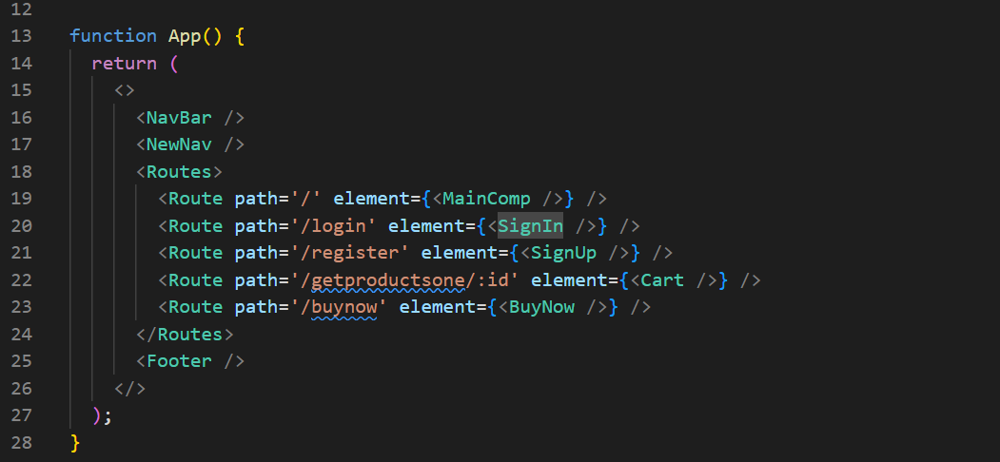

**Home page -** 

I have attached some screenshots for the home page below-
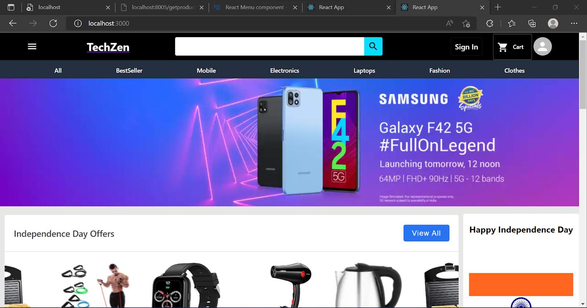
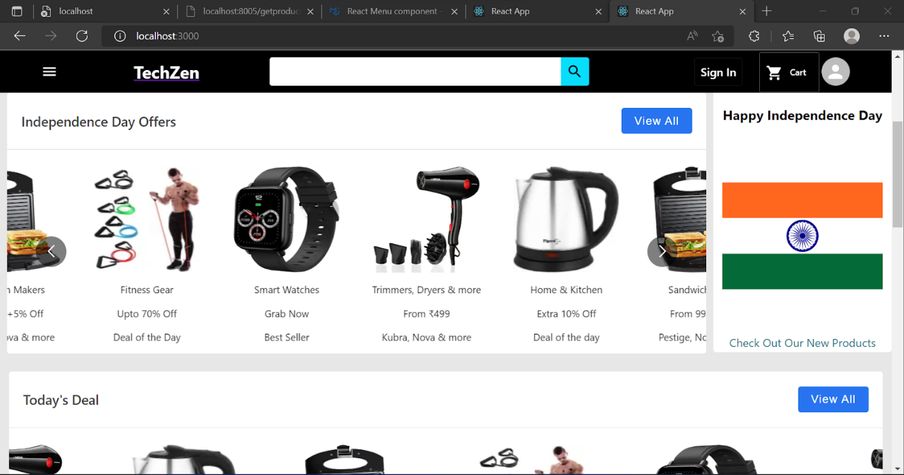
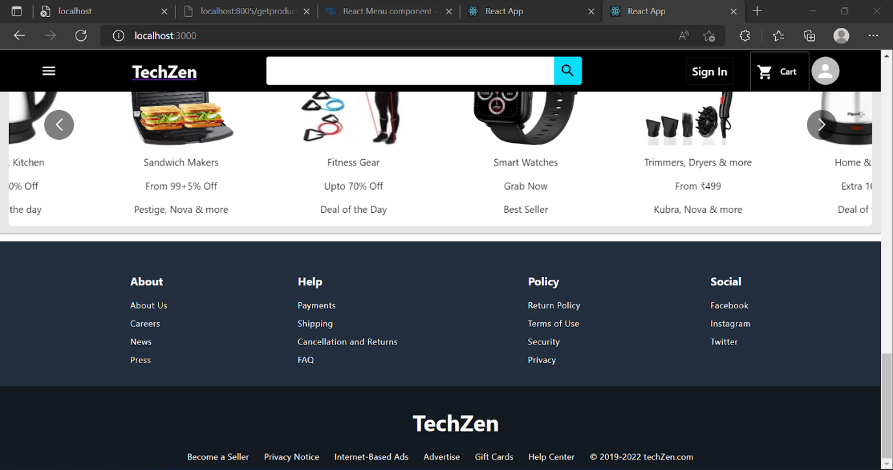

It contains 3 main components - 
-   Navigation Bar
-   Main Component
-   Footer

**Navigation Bar**

It uses React Hooks like useContext, useNavigate, useState and useEffect
hooks. Getdetailsvaliduser() gets details from the database
(TechZenWeb.Users) which helps in login  and logoutuser() helps in
logging out the user.

Below is the screenshot of Navigation Bar.

It contains a left sidebar which also contains different routes like home page, login page, signup page etc. which would be very convenient for different platforms and make the website responsive for different devices. Also, when the user is logged in, it would show an option for viewing the cart.

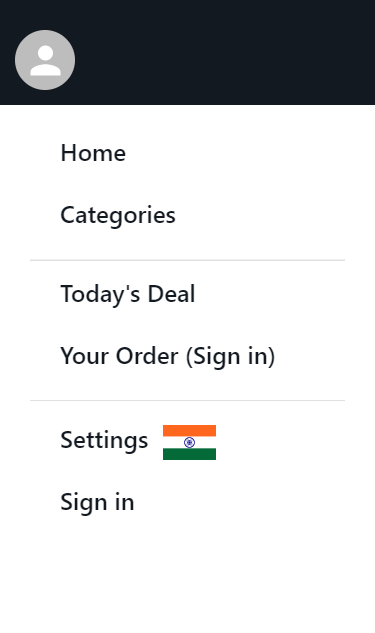      
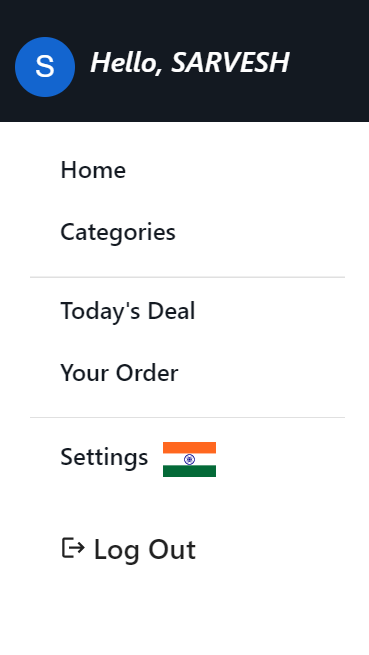

Apart from that, it contains the logo which routes back to home page when clicked and a search bar in order to search for products. It also contains sign in, cart and avatar which would be helpful when a user is logged in as it routes to register, cart page for the user.

**Footer -**

It contains basic details about the company which is generally present in every ecommerce platform. It contains different sections like about, help, policy and social. Below is a screenshot of footer page. 

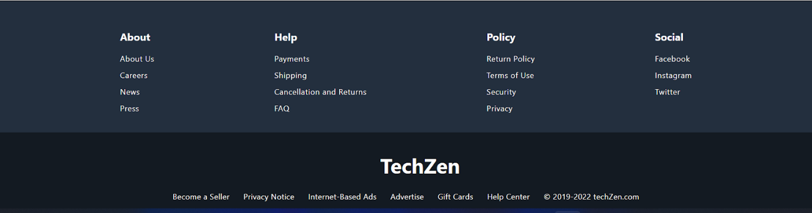

**Home page -** 

It contains different slide components which display products based on
categories. There are different categories of products present which are
displayed in form of Carousel which is present in react-multi-carousel
separated via Divider which is a material mui. Clicking on any of these
links will take us to the product description page, where the option of
adding it to cart will be present. In order to get products from the
database it uses actions and reducers which would return the payload if
it loads successfully or returns the error code for debugging the error.

**Register page -** 

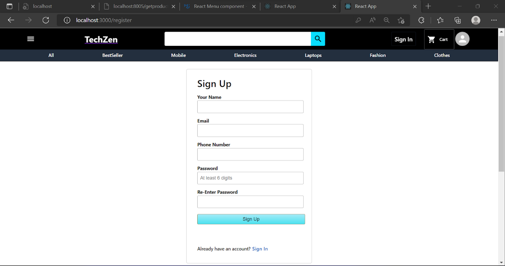

Register page contains different parameters which are stored in the
database. It uses the adddata() function to update the data in the input
column and senddata() function in order to send POST request to the
database. If there is some error because of an error in format, the
server should return 422 Unprocessable Entity, which would indicate that
the user should fill the data correctly. Otherwise, it should return
that the user is registered successfully. This is shown using
react-toastify for better UI experience. It also has a link to the login
page in case the user has already registered. The path for the register
page is "/register".

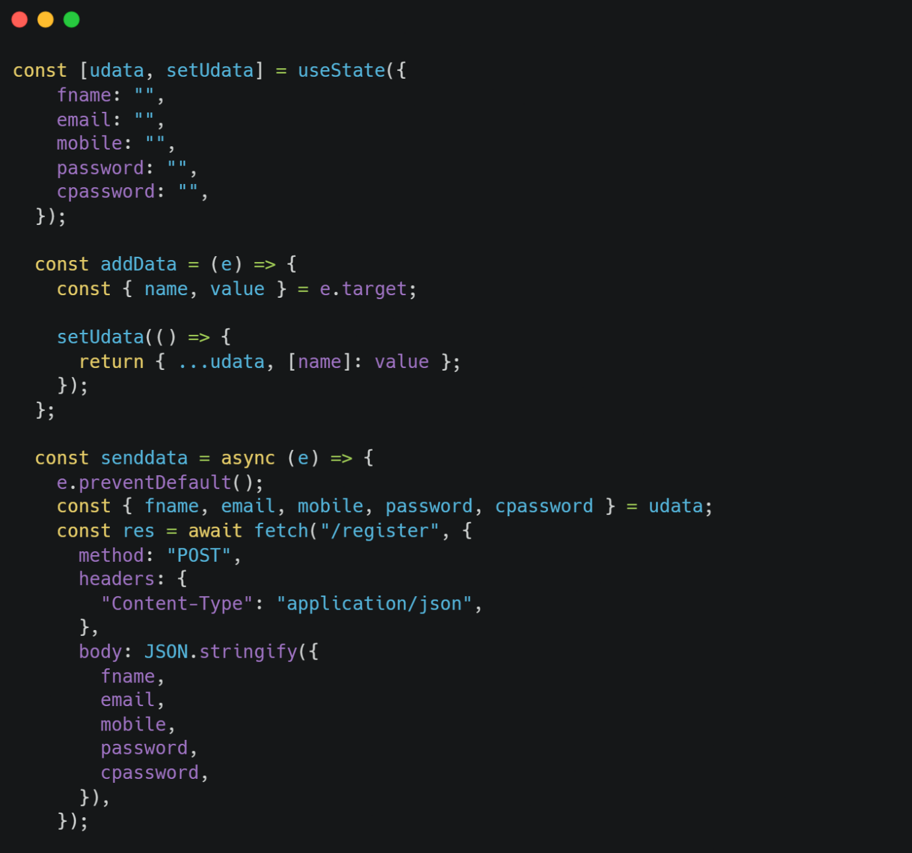

**Login page -** 

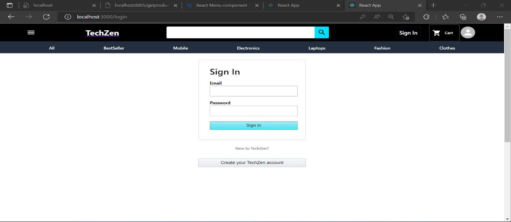

The login page contains input for email and password. It uses react
useContext hook which uses LoginContext imported from ContextProvider in
order to verify whether the entered data is present in the database or
not. In order to use the useContext hook, the index.html file for the
client side should be enclosed with ContextProvider in order to directly
use the provider inside signIn.js . If the user entered data is
incorrect, then it should return 400 Bad Request, else it should login
for the user, whose alert is getting notified with help of react
toastify. The path for the register page is "/register".

**Product description page-**

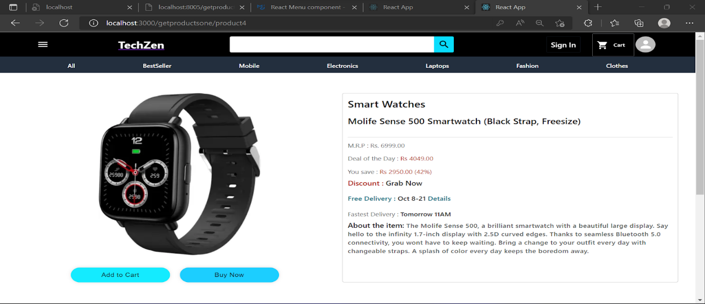

The product description page displays the product details from the
database which includes product image, description , price and discount.
Also, it has an Add to Cart button which makes use of useContext hooks
in order to check the user which is logged in and increase the cart for
that user instantaneously. It also uses a useEffect hook in order to get
data from the database based on id using the GET method. Also, when the
add to cart button is clicked, POST request is sent to the database and 
if the user is unauthorized then it should return 401 Unauthorized
response or it should add the current product to the previously existing
products data for the user.

**Checkout page -**

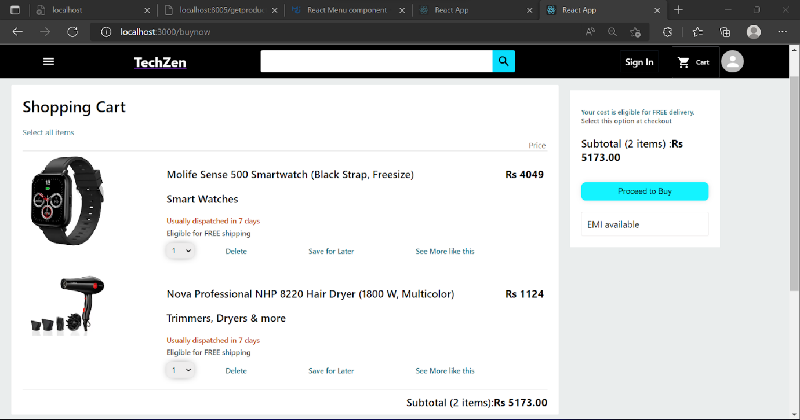

The checkout page contains the items present for a particular user in
his/her cart. It uses useState and useEffect hooks in order to get
products data from the database and set data in the cart. It again uses
useState and useEffect hooks in order to determine the total price of
all the items in the cart and use this data before proceeding with the
checkout.

# Backend (Server side) :

One of the product\'s data which is currently stored in the database is
shown below. It contains id, url, title, price, description, discount
and tagline. The data is stored in this format inside the database.

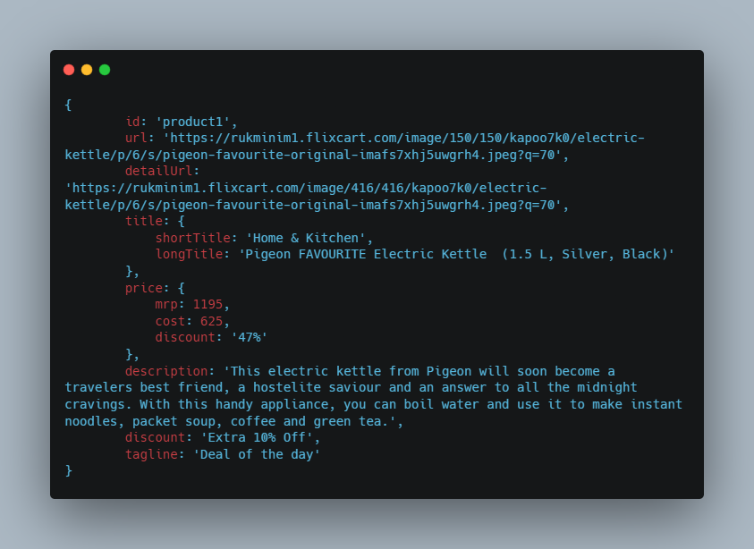

**Database -**

TechZen uses MongoDB for storing the products and user data. For making
a successful connection with the database, we install mongoose in our
node module and use connect() function for successful connection with
MongoDB. It is a noSQL database, which would be our requirement for
storing the user and product data as there could be some parameters for
products which might be relevant in a specific category but not relevant
in other categories. We have also defined some schemas for entries in
products and users which it should follow.

The products data and user data have been stored in TechZenWeb.products
and TechZenWeb.users.

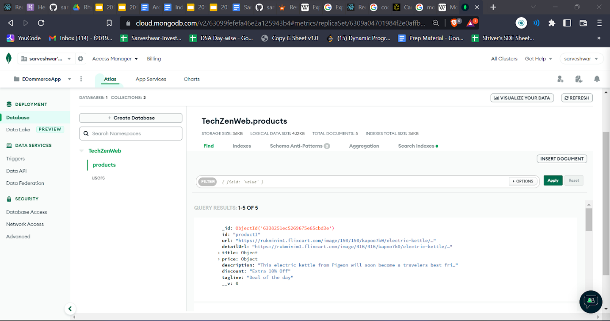

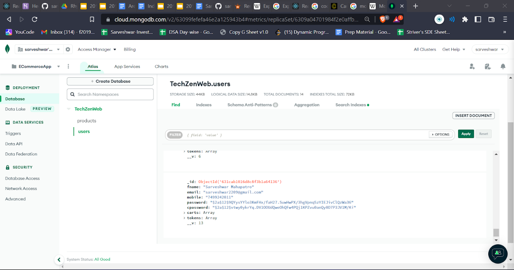

We have defined a productSchema and userSchema which the database must
follow. For userSchema, it also uses validator in order to determine
whether the email id is present in the database or not.

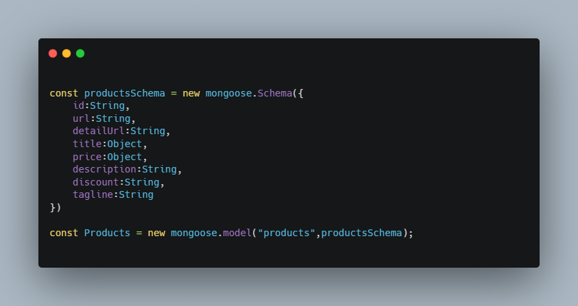

For encrypting the password, bcrypt is used. Bcrypt is a
password-hashing function based on the Blowfish cipher. Besides
incorporating a salt to protect against rainbow table attacks, bcrypt is
an adaptive function: over time, the iteration count can be increased to
make it slower, so it remains resistant to brute-force search attacks
even with increasing computational power.

A secret key has to be provided, which is present inside .env file, so
that it is not visible to public. Before saving the data, the password
is encrypted using bcrypt.

We use JWT in order to generate authentication tokens, is a proposed
Internet standard for creating data with optional signature and optional
encryption whose payload holds JSON that asserts some number of claims.
The tokens are signed either using a private secret or a public/private
key.

We use an authenticator in order to verify our token using the
jwt.verify() method using the token present in cookies. It checks
whether the user is present or not and if there is no error, it means
the user have been authenticated.

**Router -**

Routing refers to how an application's endpoints (URIs) respond to
client requests. We define routing using methods of the Express app
object that correspond to HTTP methods; for example, app.get() to handle
GET requests and app.post to handle POST requests. We can also use
app.use() to specify middleware as the callback function. These routing
methods specify a callback function called when the application receives
a request to the specified route and HTTP method. In other words, the
application "listens" for requests that match the specified route(s) and
method(s), and when it detects a match, it calls the specified callback
function.

/getproducts is used to get the products data where Products was the
model defined in ProductSchema.

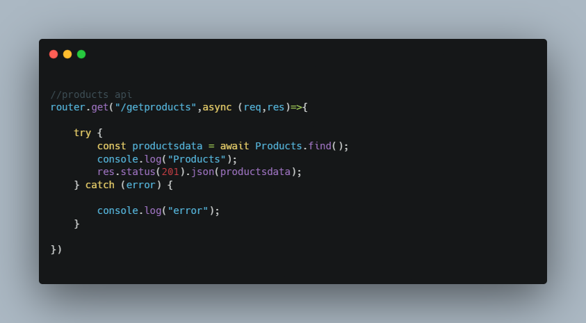

For getting the data for a particular product, "/getproductsone/{id}" is
used.

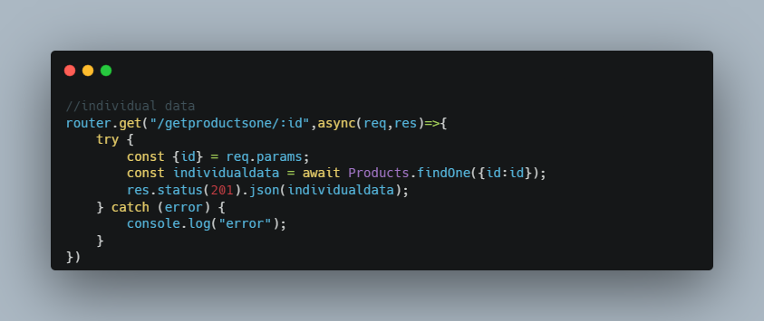

"/register" and "/login" is used to register and login a user.
"addcart/{id}"  is used for adding a particular product into the cart
after authentication.

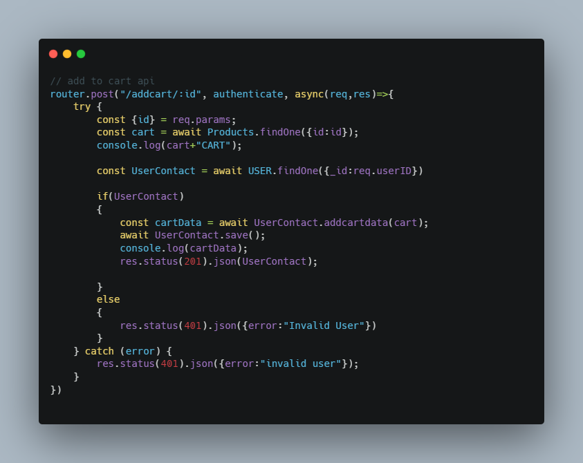

Finally, app.js is run with the help of nodemon. DefaultData is first
brought up on the database. CORS is used in order to connect client side
and server side. Cross-origin resource sharing (CORS) is a mechanism
that allows restricted resources on a web page to be requested from
another domain outside the domain from which the first resource was
served.